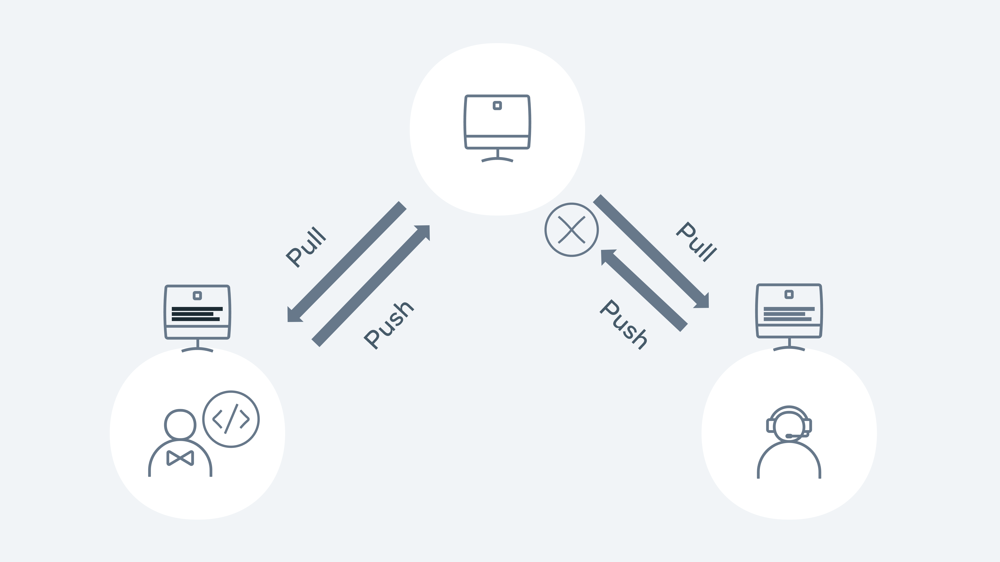

# Resolving conflicts
Conflicts will normally occur when you try to merge a branch that may have competing changes. Git will normally try to automatically merge (auto-merge), but in the case of a conflict, it will need some confirmation. The competing changes need to be resolved by the end user. This process is called merging or rebasing. 

The developer must look at the changes on the server and their local and validate which changes should be resolved.

A merge conflict example is when two developers work on their dependent branches. Both developers are working on the same file called Feature.js. Each of their tasks is to add a new feature to an existing method. Developer 1 has a branch called feature1, and developer 2 has a branch called feature2. 

Developer 1 pushes the code with the changes to the remote repository. Developer 2 pushes their changes.



Let's walk through how this would happen in Git. Both developers 1 and 2 check out the main repository on Monday morning. They both have the same copy. Both developers check out a new branch - feature 1 and 2.

```git
    git pull
    git checkout -b feature1
```
```git
  git pull
  git checkout -b feature2
```

Developer 1 makes their changes to a file called Feature.js and then commits the changes to the repository for approval via a PR (pull request)

```git
    git add Feature.js
    git commit -m 'chore: added feature 1!!'
    git pull origin main
    git push -u origin feature1
``` 

The PR is reviewed and then merged into the main branch. Meanwhile, Developer 2 is starting to code on his feature. Again, they go through the same process as Developer 1:
```git
    git add Feature.js
    git commit -m 'chore: added feature 2!!!'
    git pull origin main

From github.com:demo/demo-repo
 * branch            main       -> FETCH_HEAD
   9012934..d3b3cc0  main       -> origin/main
Auto-merging Feature.js
CONFLICT (content): Merge conflict in Feature.js
Automatic merge failed; fix conflicts and then commit the result.
```

Git lets us know that a merge conflict has occurred and needs to be fixed before it can be pushed to the remote repo. Running git status will also give us the same level of detail:

```git
    git status
    On branch feature2
You have unmerged paths.
  (fix conflicts and run "git commit")
  (use "git merge --abort" to abort the merge)

Unmerged paths:
  (use "git add <file>..." to mark resolution)
        both modified:   Feature.js

no changes added to commit (use "git add" and/or "git commit -a")
```
In order to merge, Developer 2 needs to see and compare the changes from Developer 1. It is good practice to first see what branch is causing the merge issue. Developer 2 runs the following command:
```git
 git log --merge

commit 79bca730b68e5045b38b96bec35ad374f44fe4e3 (HEAD -> feature2)
Author: Developer 2 
<developer2@demo.com>
Date:   Sat Jan 29 16:55:40 2022 +0000

    chore: add feature 2

commit 678b0648107b7c53e90682f2eb8103c59f3cb0c0
Author: Developer 1 
<developer1@demo.com>
Date:   Sat Jan 29 16:53:40 2022 +0000

    chore: add feature 1
```
We can see from the above code that the team's conflicting changes occurred in feature 1 and 2 branches. Developer 2 now wants to see the change that is causing the conflict.

```git
git diff

diff --cc Feature.js
index 1b1136f,c3be92f..0000000
--- a/Feature.js
+++ b/Feature.js
@@@ -1,4 -1,4 +1,8 @@@
  let add = (a, b) => {
++<<<<<<< HEAD
 +  if(a + b > 10) { return 'way too much'}
++=======
+   if(a + b > 10){ return 'too much' }
++>>>>>>> d3b3cc0d9b6b084eef3e0afe111adf9fe612898e
    return a + b;
  }

```
The only difference is the wording in the return statement. Developer 1 added 'too much,' but Developer 2 added 'far too much. Everything else is identical in terms of merging and it's a pretty easy fix. Git will show arrows <<< >>> to signify the changes. Developer 2 removes the markers so the code is ready for submission:
```git
let add = (a, b) => {
  if(a + b > 10) { return 'way too much'}
  return a + b;
}
```
```git
 git add Feature.js
 git commit -m 'fix merge conflicts'
 git push -u origin feature2
 ```
 Developer 2 has now fixed a merge conflict and can create their PR to get the code merged into the main line.

